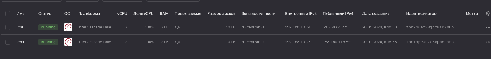
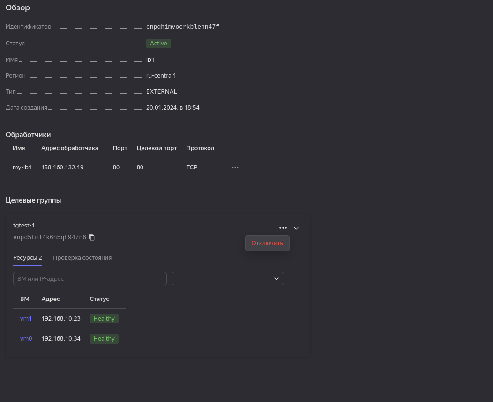

# Домашнее задание к занятию «Отказоустойчивость в облаке»


## Задание 1 

Возьмите за основу [решение к заданию 1 из занятия «Подъём инфраструктуры в Яндекс Облаке»](https://github.com/netology-code/sdvps-homeworks/blob/main/7-03.md#задание-1).

1. Теперь вместо одной виртуальной машины сделайте terraform playbook, который:

- создаст 2 идентичные виртуальные машины. Используйте аргумент [count](https://www.terraform.io/docs/language/meta-arguments/count.html) для создания таких ресурсов;
- создаст [таргет-группу](https://registry.terraform.io/providers/yandex-cloud/yandex/latest/docs/resources/lb_target_group). Поместите в неё созданные на шаге 1 виртуальные машины;
- создаст [сетевой балансировщик нагрузки](https://registry.terraform.io/providers/yandex-cloud/yandex/latest/docs/resources/lb_network_load_balancer), который слушает на порту 80, отправляет трафик на порт 80 виртуальных машин и http healthcheck на порт 80 виртуальных машин.

2. Установите на созданные виртуальные машины пакет Nginx любым удобным способом и запустите Nginx веб-сервер на порту 80.

3. Перейдите в веб-консоль Yandex Cloud и убедитесь, что: 

- созданный балансировщик находится в статусе Active,
- обе виртуальные машины в целевой группе находятся в состоянии healthy.

4. Сделайте запрос на 80 порт на внешний IP-адрес балансировщика и убедитесь, что вы получаете ответ в виде дефолтной страницы Nginx.

*В качестве результата пришлите:*

*1. Terraform Playbook.*

*2. Скриншот статуса балансировщика и целевой группы.*

*3. Скриншот страницы, которая открылась при запросе IP-адреса балансировщика.*

---
## Ответ
<details> 

<summary>main.tf</summary>

```bash
terraform {
  required_providers {
    yandex = {
      source = "yandex-cloud/yandex"
    }
  }
}
provider "yandex" {
  token     = "y0_AgAAAABwkEPgAATuwQAAAADxRDFWCaiGhz_8RcOe8hYzuvCEDP2RD0M"
  cloud_id  = "b1g7nshdjbnhelq4oca9"
  folder_id = "b1gcn5ahgd86svtfa362"
  zone      = "ru-central1-a"
}

resource "yandex_compute_instance" "vm" {
  count = 2 
  name = "vm${count.index}"
  platform_id = "standard-v2"

  resources {
    core_fraction = "100"
    cores         = "2"
    memory        = "2"
  }

  boot_disk {
    initialize_params {
      image_id = "fd89iq8mqvli97d9poej"
      size = "10"
    }
  }
  network_interface {
    subnet_id = yandex_vpc_subnet.subnet-1.id
    nat       = true
  }
  scheduling_policy {
    preemptible = true
  }
  metadata = {
    user-data = "${file("./meta.txt")}"
  }
}
##


resource "yandex_vpc_network" "network-1" {
  name = "network1"
}

resource "yandex_vpc_subnet" "subnet-1" {
  name           = "subnet1"
  v4_cidr_blocks = ["192.168.10.0/24"]
  network_id     = "${yandex_vpc_network.network-1.id}"
}

##
resource "yandex_lb_network_load_balancer" "lb1" {
  name = "lb1"
  listener {
    name = "my-lb1"
    port = 80 
    external_address_spec {
      ip_version = "ipv4"
    }
  }

  attached_target_group {
    target_group_id = yandex_lb_target_group.tgtest-1.id
    healthcheck {
      name = "http"
      http_options {
        port = 80
        path = "/"
      }
    }
  }
}

resource "yandex_lb_target_group" "tgtest-1" {
  name = "tgtest-1"

  target {
    subnet_id = yandex_vpc_subnet.subnet-1.id
    address   = yandex_compute_instance.vm[0].network_interface.0.ip_address
  }

  target {
    subnet_id = yandex_vpc_subnet.subnet-1.id
    address   = yandex_compute_instance.vm[1].network_interface.0.ip_address
  }
}
```

</details> 

<details>

<summary>Screenshots </summary>

- 
- 
- 

</details>


